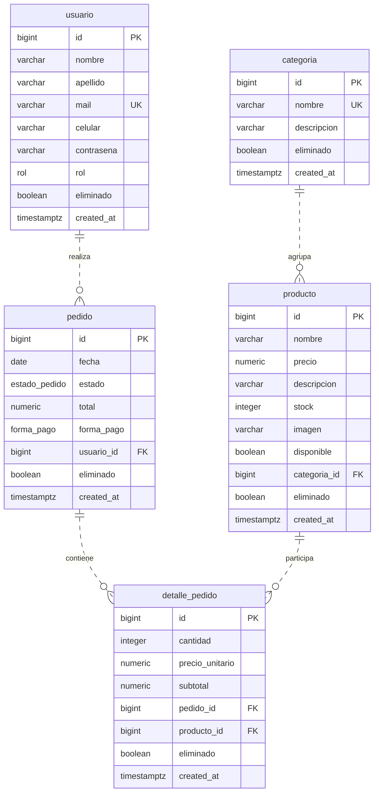

# Modelo Entidad-Relación — Food Store

El modelo vigente contiene las cinco entidades y los 40 atributos de
[schema.sql](../../schema.sql). Los tipos exactos, defaults y restricciones
están en el [modelo relacional](modelo_relacional.md).

## Diagrama ER

`PK` indica clave primaria; `FK`, referencia; `UK`, unicidad. Las cinco PK
son `id`, generadas por identidad. En detalle existe además una restricción
conjunta `UNIQUE(pedido_id, producto_id)`: ninguna FK es individualmente
única y ninguna integra la PK.

`||` significa exactamente uno y `o{`, cero o muchos. Las cuatro líneas
discontinuas son relaciones no identificantes: las FK no forman parte de
la PK del hijo. Mermaid abrevia longitudes y precisión; los tipos exactos
se documentan en el modelo relacional.

## Cardinalidades y participación

| Relación 1:N | Participación del hijo | Participación del padre |
|---|---|---|
| `categoria` → `producto` | Cada producto pertenece exactamente a una categoría: `categoria_id` es FK NOT NULL. | Una categoría puede tener cero o muchos productos. |
| `usuario` → `pedido` | Cada pedido pertenece exactamente a un usuario: `usuario_id` es FK NOT NULL. | Un usuario puede tener cero o muchos pedidos. |
| `pedido` → `detalle_pedido` | Cada detalle pertenece exactamente a un pedido: `pedido_id` es FK NOT NULL. | Un pedido puede tener cero o muchos detalles. |
| `producto` → `detalle_pedido` | Cada detalle pertenece exactamente a un producto: `producto_id` es FK NOT NULL. | Un producto puede aparecer en cero o muchos detalles. |

Las FK garantizan la existencia del padre para cada hijo, pero no obligan
al padre a tener hijos. Todas usan `ON DELETE RESTRICT`, sin borrado en cascada.

## Relación conceptual N:M

`pedido N:M producto` se resuelve mediante `detalle_pedido`, una entidad
asociativa con identidad propia `id`. Su clave candidata alternativa
`{pedido_id, producto_id}` está respaldada por UNIQUE y ambas columnas NOT NULL.

El mismo producto puede aparecer como máximo una vez dentro de un pedido;
`cantidad` representa las unidades de esa línea. La unicidad también alcanza
las filas con baja lógica: no es una restricción parcial. No existe una FK
directa entre pedido y producto.

## Semántica de los atributos

- **Usuario y minimización:** `contrasena` y `celular` pertenecen al modelo
  base. La vista pública de Unidad 3 las omite para minimizar datos, pero
  eso no elimina estas columnas de la entidad.
- **Disponibilidad y baja lógica:** `producto.disponible` expresa una
  condición comercial/operativa; `eliminado` expresa baja lógica. No son sinónimos.
- **Fechas:** `pedido.fecha` es DATE; los cinco `created_at` son TIMESTAMPTZ
  y registran una marca temporal técnica.
- **Importes:** `detalle_pedido.subtotal` y `pedido.total` son físicos. El
  primero deriva de cantidad y precio histórico de la línea; el segundo
  agrega subtotales de detalles vigentes. El esquema todavía no mantiene
  automáticamente estas reglas: corresponden a la siguiente capa programable.
- **Historia:** la baja lógica de usuario, producto o categoría no borra
  físicamente sus filas ni debe destruir la historia de pedidos. No se añaden
  reglas de cancelación, reposición de stock o reactivación no definidas.

## Alcance histórico

TP1–TP4 documentan etapas anteriores y permanecen como evidencia histórica
evaluada; no se afirma que siempre hayan usado esta estructura. La autoridad
vigente del TPI es `schema.sql`.

La columna experimental `detalle_pedido.categoria_id` de Unidad 4 **no forma
parte del modelo canónico**. Su estado es `VALID_EXPERIMENT` /
`REJECTED_AFTER_MEASUREMENT` / `DO_NOT_ADOPT`; no se incorpora al diagrama.
El análisis de redundancias físicas oficiales está en
[normalización](normalizacion.md).
