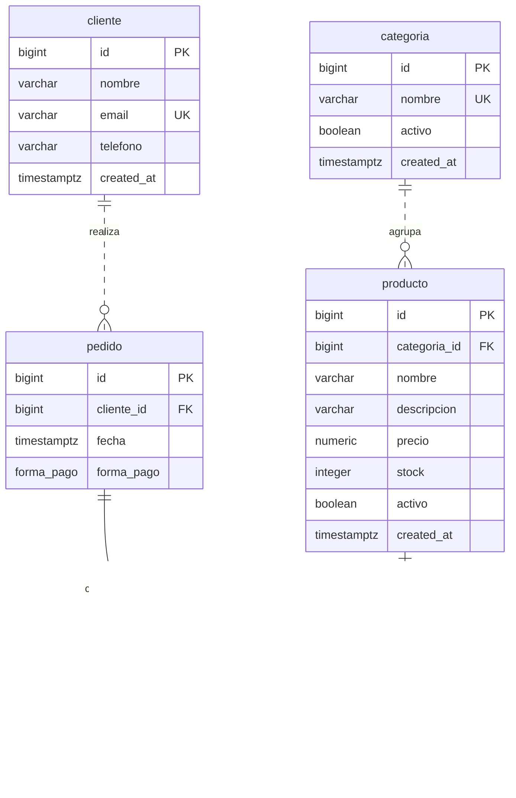

# Modelo Entidad-Relación — Food Store

Este modelo representa exclusivamente las cinco tablas y todos los atributos
de [schema.sql](../../schema.sql). Documenta el modelo base sin modificarlo
ni incorporar extensiones de los laboratorios históricos.

## Diagrama ER

`PK` identifica la clave primaria; `FK`, una clave foránea; `UK`, una
restricción de unicidad. Los dos atributos marcados `PK` en `detalle_pedido`
forman una sola clave compuesta, no dos claves independientes.

`||` significa exactamente uno y `o{`, cero o muchos. Las líneas discontinuas
son relaciones no identificantes: la FK no integra la PK del hijo. Las
líneas continuas son identificantes: ambas FK integran la PK de la asociación.
El diagrama simplifica longitudes y precisión; los tipos exactos están en el
[modelo relacional](modelo_relacional.md).

## Cardinalidades y participación

| Relación 1:N | Participación del hijo | Participación del padre |
|---|---|---|
| `categoria` → `producto` | Cada producto debe pertenecer exactamente a una categoría: `categoria_id` es `NOT NULL` y FK. | Una categoría puede no tener productos o tener muchos. |
| `cliente` → `pedido` | Cada pedido debe pertenecer exactamente a un cliente: `cliente_id` es `NOT NULL` y FK. | Un cliente puede no tener pedidos o tener muchos. |
| `pedido` → `detalle_pedido` | Cada detalle debe pertenecer exactamente a un pedido: `pedido_id` es `NOT NULL` y FK. | Un pedido puede existir sin detalles o tener muchos. |
| `producto` → `detalle_pedido` | Cada detalle debe pertenecer exactamente a un producto: `producto_id` es `NOT NULL` y FK. | Un producto puede no aparecer todavía en pedidos o aparecer en muchos. |

Las FK garantizan la existencia del padre para cada hijo, pero no obligan al
padre a tener hijos. Por eso no se impone una participación mínima de uno
del lado de los productos de una categoría o de los detalles de un pedido.

## Relación conceptual N:M

Un `pedido` puede contener varios productos y un `producto` puede participar
en varios pedidos: `pedido N:M producto`. Físicamente se resuelve mediante
`detalle_pedido`, que registra la asociación y sus atributos `cantidad` y
`precio_unitario`.

La PK `(pedido_id, producto_id)` permite como máximo una línea de un mismo
producto en cada pedido. La cantidad de unidades pertenece a esa línea.
No existe una FK directa entre `pedido` y `producto` ni un identificador
adicional para el detalle. El pasaje está desarrollado en el
[modelo relacional](modelo_relacional.md) y su análisis de dependencias en
[normalización](normalizacion.md).
